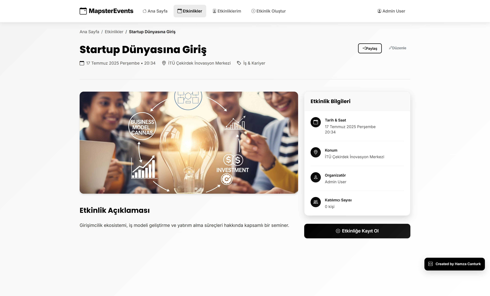
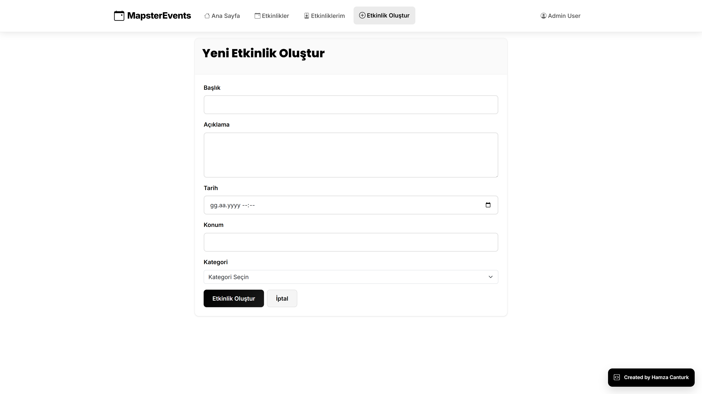
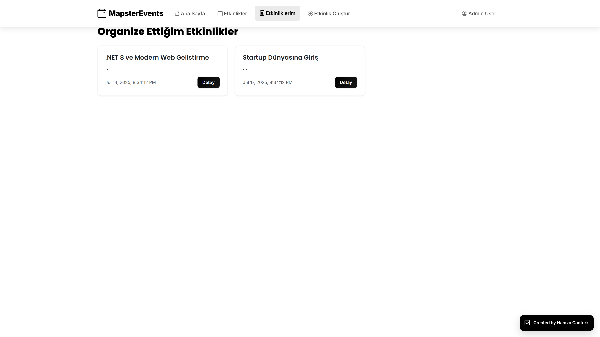

# 🎯 MapsterEvents - Modern Etkinlik Yönetim Platformu

Modern n-tier mimari ile geliştirilmiş, Mapster kütüphanesini kullanarak yüksek performanslı object mapping sağlayan profesyonel bir etkinlik yönetim platformu. ASP.NET Core 8.0 Web API (Backend) ve Angular 20 (Frontend) teknolojileri ile enterprise-level standartlarda geliştirilmiş portfolyo projesi.

## 📋 İçindekiler

- [🎯 Proje Özeti](#-proje-özeti)
- [🛠 Teknoloji Stacki](#-teknoloji-stacki)
- [🏗 Mimari Yapı](#-mimari-yapı)
- [🚀 Kurulum ve Çalıştırma](#-kurulum-ve-çalıştırma)
- [📖 Kullanım Kılavuzu](#-kullanım-kılavuzu)
- [📁 Proje Yapısı](#-proje-yapısı)
- [✨ Özellikler](#-özellikler)
- [🎨 Ekran Görüntüleri](#-ekran-görüntüleri)
- [📱 API Endpoints](#-api-endpoints)
- [🔐 Güvenlik Özellikleri](#-güvenlik-özellikleri)
- [📈 Performans Optimizasyonları](#-performans-optimizasyonları)
- [🧪 Test Kullanıcıları](#-test-kullanıcıları)
- [🔧 Konfigürasyon](#-konfigürasyon)
- [🐛 Sorun Giderme](#-sorun-giderme)
- [📞 İletişim](#-iletişim)

## 🎯 Proje Özeti

MapsterEvents, modern web geliştirme teknolojileri ve enterprise-level architecture patterns kullanılarak geliştirilmiş kapsamlı bir etkinlik yönetim platformudur. Clean Architecture prensiplerine uygun N-tier mimari yapısında tasarlanmış, yüksek performans ve ölçeklenebilirlik odaklı profesyonel bir çözümdür.

### Temel Özellikler:
- 🏗 **Enterprise N-Tier Architecture**: Clean Architecture ve SOLID prensipleri
- ⚡ **High-Performance Mapping**: Mapster ile optimize edilmiş object mapping
- 🔒 **JWT Authentication**: Token tabanlı güvenli kimlik doğrulama
- 🎨 **Modern Angular UI**: Angular 20 ile responsive ve kullanıcı dostu arayüz
- 📊 **Real-time Data**: Canlı etkinlik güncellemeleri ve bildirimler
- 🗃 **Advanced Database Design**: EF Core ile optimize edilmiş veri erişimi
- 📱 **Mobile-First Design**: Tüm cihazlarda mükemmel deneyim
- 🚀 **Production Ready**: Kapsamlı hata yönetimi ve logging

## 🛠 Teknoloji Stacki

### Backend Stack
- **🔧 Framework**: ASP.NET Core 8.0 Web API
- **⚡ Object Mapping**: Mapster (Yüksek performanslı DTO dönüşümleri)
- **💾 Database**: Microsoft SQL Server Express
- **🗃 ORM**: Entity Framework Core 8.0
- **🔐 Authentication**: JWT (JSON Web Tokens)
- **📚 API Documentation**: Swagger/OpenAPI 3.0
- **🛡 Security**: ASP.NET Core Identity PasswordHasher

### Frontend Stack
- **🅰 Framework**: Angular 20 (Latest)
- **🎨 UI Framework**: Bootstrap 5.3
- **📱 Design**: Responsive, Mobile-First
- **🎯 Icons**: Bootstrap Icons
- **📡 HTTP Client**: Angular HttpClient dengan interceptors
- **🔄 State Management**: Angular Services & RxJS

### Database & Architecture
- **🏗 Architecture**: N-Tier (Core, Repository, Service, API, UI)
- **📦 Patterns**: Repository Pattern, Unit of Work, CQRS
- **🔄 Database Approach**: Code-First Migrations
- **📊 Data Relations**: Foreign Key constraints, Navigation properties
- **🚀 Performance**: Lazy loading, async operations

### DevOps & Tools
- **📋 Logging**: Microsoft.Extensions.Logging
- **🏥 Health Checks**: Application monitoring
- **🔒 CORS**: Cross-origin resource sharing
- **🐳 Development**: LocalDB, dotnet CLI
- **🧪 Testing Infrastructure**: Unit test ready architecture

## 🏗 Mimari Yapı

Proje Clean Architecture prensiplerine uygun N-tier (çok katmanlı) mimari yapısında geliştirilmiştir:

```
📁 MapsterEvents/
├── 📁 MapsterEvents.Core/                # 🎯 Domain Layer
│   ├── 📁 Entities/                      # Domain Models & BaseEntity
│   │   ├── 📄 BaseEntity.cs              # Audit trail base entity
│   │   ├── 📄 Event.cs                   # Event domain model
│   │   ├── 📄 Category.cs                # Category entity
│   │   ├── 📄 User.cs                    # User entity
│   │   └── 📄 Registration.cs            # Event registration entity
│   ├── 📁 DTOs/                          # Data Transfer Objects
│   │   ├── 📄 EventDto.cs                # Event DTOs
│   │   ├── 📄 CategoryDto.cs             # Category DTOs
│   │   ├── 📄 UserDto.cs                 # User DTOs
│   │   └── 📄 Attributes/                # Custom validation attributes
│   └── 📁 Interfaces/                    # Contracts & Abstractions
│       ├── 📄 IGenericRepository.cs      # Generic repository contract
│       ├── 📄 IEventRepository.cs        # Event-specific repository
│       └── 📄 IAuthService.cs            # Authentication service
│
├── 📁 MapsterEvents.Repository/          # 🗃 Data Access Layer
│   ├── 📁 Data/                          # DbContext & Database config
│   │   ├── 📄 MapsterEventsDbContext.cs  # EF Core DbContext
│   │   └── 📄 DbSeeder.cs                # Seed data & initial setup
│   └── 📁 Repositories/                  # Repository implementations
│       ├── 📄 GenericRepository.cs       # Base repository
│       ├── 📄 EventRepository.cs         # Event data operations
│       ├── 📄 CategoryRepository.cs      # Category operations
│       └── 📄 UserRepository.cs          # User data operations
│
├── 📁 MapsterEvents.Service/             # 🔧 Business Logic Layer
│   ├── 📁 Services/                      # Business services
│   │   ├── 📄 EventService.cs            # Event business logic
│   │   ├── 📄 CategoryService.cs         # Category management
│   │   └── 📄 AuthService.cs             # Authentication logic
│   ├── 📁 Mappings/                      # Mapster configurations
│   │   ├── 📄 EventMappingConfig.cs      # Event mapping profiles
│   │   └── 📄 CategoryMappingConfig.cs   # Category mappings
│   └── 📁 Helpers/                       # Utility classes
│
├── 📁 MapsterEvents.API/                 # 🌐 Web API Layer
│   ├── 📁 Controllers/                   # REST API endpoints
│   │   ├── 📄 EventsController.cs        # Event CRUD operations
│   │   ├── 📄 CategoriesController.cs    # Category management
│   │   └── 📄 AuthController.cs          # Authentication endpoints
│   ├── 📁 Middleware/                    # Custom middleware
│   │   └── 📄 GlobalExceptionMiddleware.cs # Error handling
│   └── 📄 Program.cs                     # Application configuration
│
└── 📁 MapsterEvents.UI/                  # 🅰 Angular Frontend
    ├── 📁 src/app/
    │   ├── 📁 components/                # Angular components
    │   │   ├── 📁 events/                # Event-related components
    │   │   ├── 📁 auth/                  # Authentication components
    │   │   └── 📁 shared/                # Shared components
    │   ├── 📁 services/                  # API services
    │   │   ├── 📄 event.service.ts       # Event API service
    │   │   ├── 📄 auth.service.ts        # Authentication service
    │   │   └── 📄 category.service.ts    # Category service
    │   ├── 📁 models/                    # TypeScript interfaces
    │   ├── 📁 interceptors/              # HTTP interceptors
    │   └── 📁 guards/                    # Route guards
    └── 📁 public/                        # Static assets
        └── 📁 images/                    # Event images
```

### Katman Sorumlulukları:

1. **🎯 Core (Domain)**: Entities, DTOs, interfaces ve domain logic
2. **🗃 Repository**: Veri erişim katmanı, EF Core implementasyonları
3. **🔧 Service**: İş mantığı, Mapster konfigürasyonları ve business rules
4. **🌐 API**: RESTful endpoints, middleware ve API konfigürasyonu
5. **🅰 UI**: Angular frontend, responsive tasarım ve kullanıcı deneyimi

## 🚀 Kurulum ve Çalıştırma

### Gereksinimler

- ✅ .NET 8.0 SDK
- ✅ Microsoft SQL Server Express (veya LocalDB)
- ✅ Node.js 18+ (Angular için)
- ✅ Angular CLI 20+
- ✅ Visual Studio 2022 / VS Code / JetBrains Rider

### 1. Projeyi İndirin

```bash
git clone https://github.com/hamzacanturk/MapsterEvents.git
cd MapsterEvents
```

### 2. Backend Kurulumu

```bash
# NuGet paketlerini yükle
dotnet restore

# Veritabanı migration'ları uygula
cd MapsterEvents.API
dotnet ef database update

# API'yi çalıştır
dotnet run
```

**🌐 API Erişim URL'leri:**
- **HTTPS**: `https://localhost:7147`
- **HTTP**: `http://localhost:5145`
- **Swagger UI**: `https://localhost:7147/swagger`
- **Health Check**: `https://localhost:7147/health`

### 3. Frontend Kurulumu

```bash
# UI klasörüne geç
cd MapsterEvents.UI

# Node.js dependencies yükle
npm install

# Angular uygulamasını çalıştır
npm start
# veya
ng serve
```

**🅰 Frontend Erişim URL'i:**
- **Angular App**: `http://localhost:4200`

### 4. İlk Çalıştırma

1. **API'yi başlat** (`dotnet run` ile)
2. **Angular uygulamasını başlat** (`npm start` ile)
3. **Tarayıcıda aç**: `http://localhost:4200`
4. **Test kullanıcısı ile giriş yap**: `admin@mapsterevents.com` / `Admin123!`

## 📖 Kullanım Kılavuzu

### 🏠 Ana Sayfa & Dashboard
- **Modern Tasarım**: Professional landing page
- **Etkinlik Özetleri**: Yaklaşan etkinliklerin preview'ı
- **Kategori Filtreleme**: Hızlı erişim için kategori linkleri
- **Responsive Layout**: Tüm cihazlarda optimum görünüm

### 🎟 Etkinlik Yönetimi

#### Etkinlik Listeleme:
1. **Tüm Etkinlikler** sayfasına gidin
2. **Filtreleme seçenekleri** kullanın (kategori, tarih, durum)
3. **Arama fonksiyonu** ile istediğiniz etkinliği bulun
4. **Sayfalama** ile sonuçları browse edin

#### Etkinlik Detayları:
- **Tam Açıklama**: Detaylı etkinlik bilgileri
- **Katılımcı Listesi**: Kayıtlı kullanıcılar
- **Organizatör Bilgileri**: İletişim detayları
- **Kayıt/İptal**: Tek tık ile etkinlik kaydı

#### Etkinlik Oluşturma:
1. **"Etkinlik Oluştur"** sayfasına gidin
2. **Form alanlarını** doldurun (başlık, açıklama, tarih, lokasyon)
3. **Kategori seçin** ve resim ekleyin
4. **Kaydet** butonuna tıklayın

### 👤 Kullanıcı Yönetimi

#### Kayıt Ol:
- **E-posta** ve güçlü **şifre** ile hesap oluşturun
- **Otomatik doğrulama** sistemi
- **Anında giriş** yapabilme

#### Giriş Yap:
- **JWT token** tabanlı güvenli giriş
- **"Beni Hatırla"** özelliği
- **Otomatik token yenileme**

### 📊 Etkinlik Kategorileri
- **Teknoloji**: Yazılım, programlama, innovation
- **Eğitim**: Kişisel gelişim, akademik etkinlikler
- **Spor**: Fiziksel aktiviteler, turnuvalar
- **Sanat**: Kültür, sanat, yaratıcılık
- **İş & Kariyer**: Networking, profesyonel gelişim

## 📁 Proje Yapısı

<details>
<summary>🔍 Detaylı Dosya Yapısı</summary>

```
📁 MapsterEvents/
├── 📄 MapsterEvents.sln                 # Solution file
├── 📄 README.md                         # Bu dokümantasyon
├── 📄 .gitignore                        # Git ignore rules
│
├── 📁 MapsterEvents.Core/               # 🎯 Domain Layer
│   ├── 📁 Entities/
│   │   ├── 📄 BaseEntity.cs             # Audit trail ve common properties
│   │   ├── 📄 Event.cs                  # Etkinlik domain model
│   │   ├── 📄 Category.cs               # Kategori entity
│   │   ├── 📄 User.cs                   # Kullanıcı entity
│   │   └── 📄 Registration.cs           # Etkinlik kaydı entity
│   ├── 📁 DTOs/
│   │   ├── 📄 EventCreateDto.cs         # Etkinlik oluşturma DTO
│   │   ├── 📄 EventUpdateDto.cs         # Etkinlik güncelleme DTO
│   │   ├── 📄 EventListItemDto.cs       # Liste görünümü DTO
│   │   ├── 📄 EventDetailDto.cs         # Detay görünümü DTO
│   │   ├── 📄 UserLoginDto.cs           # Giriş DTO
│   │   ├── 📄 UserRegisterDto.cs        # Kayıt DTO
│   │   └── 📁 Attributes/               # Custom validation
│   │       └── 📄 FutureDateAttribute.cs # Tarih validation
│   └── 📁 Interfaces/
│       ├── 📄 IGenericRepository.cs     # Generic repository pattern
│       ├── 📄 IEventRepository.cs       # Event repository contract
│       ├── 📄 ICategoryRepository.cs    # Category repository contract
│       ├── 📄 IUserRepository.cs        # User repository contract
│       ├── 📄 IEventService.cs          # Event business logic
│       ├── 📄 ICategoryService.cs       # Category service
│       └── 📄 IAuthService.cs           # Authentication service
│
├── 📁 MapsterEvents.Repository/         # 🗃 Data Access Layer
│   ├── 📁 Data/
│   │   ├── 📄 MapsterEventsDbContext.cs # EF Core DbContext
│   │   └── 📄 DbSeeder.cs               # Seed data ve initial setup
│   └── 📁 Repositories/
│       ├── 📄 GenericRepository.cs      # Base repository implementation
│       ├── 📄 EventRepository.cs        # Event-specific queries
│       ├── 📄 CategoryRepository.cs     # Category operations
│       └── 📄 UserRepository.cs         # User data operations
│
├── 📁 MapsterEvents.Service/            # 🔧 Business Logic Layer
│   ├── 📁 Services/
│   │   ├── 📄 EventService.cs           # Event business logic
│   │   ├── 📄 CategoryService.cs        # Category management
│   │   └── 📄 AuthService.cs            # Authentication & JWT
│   ├── 📁 Mappings/
│   │   ├── 📄 EventMappingConfig.cs     # Event mapping profiles
│   │   └── 📄 CategoryMappingConfig.cs  # Category mappings
│   ├── 📁 Helpers/
│   │   └── 📄 TextHelper.cs             # Utility methods
│   └── 📄 ServiceRegistration.cs        # DI container registration
│
├── 📁 MapsterEvents.API/                # 🌐 Web API Layer
│   ├── 📁 Controllers/
│   │   ├── 📄 EventsController.cs       # Event CRUD endpoints
│   │   ├── 📄 CategoriesController.cs   # Category management
│   │   └── 📄 AuthController.cs         # Authentication endpoints
│   ├── 📁 Middleware/
│   │   └── 📄 GlobalExceptionMiddleware.cs # Global error handling
│   ├── 📁 Properties/
│   │   └── 📄 launchSettings.json       # Launch configuration
│   ├── 📄 Program.cs                    # App configuration & DI
│   ├── 📄 appsettings.json             # Configuration
│   └── 📄 appsettings.Development.json # Dev configuration
│
└── 📁 MapsterEvents.UI/                 # 🅰 Angular Frontend
    ├── 📁 src/
    │   ├── 📁 app/
    │   │   ├── 📁 components/
    │   │   │   ├── 📁 events/
    │   │   │   │   ├── 📁 event-list/
    │   │   │   │   ├── 📁 event-detail/
    │   │   │   │   └── 📁 event-create/
    │   │   │   ├── 📁 auth/
    │   │   │   │   ├── 📁 login/
    │   │   │   │   └── 📁 register/
    │   │   │   └── 📁 shared/
    │   │   │       ├── 📁 navbar/
    │   │   │       ├── 📁 footer/
    │   │   │       └── 📁 loading/
    │   │   ├── 📁 services/
    │   │   │   ├── 📄 event.service.ts
    │   │   │   ├── 📄 auth.service.ts
    │   │   │   └── 📄 category.service.ts
    │   │   ├── 📁 models/
    │   │   │   ├── 📄 event.model.ts
    │   │   │   ├── 📄 user.model.ts
    │   │   │   └── 📄 category.model.ts
    │   │   ├── 📁 interceptors/
    │   │   │   └── 📄 auth.interceptor.ts
    │   │   ├── 📁 guards/
    │   │   │   └── 📄 auth.guard.ts
    │   │   └── 📄 app.component.ts
    │   ├── 📁 environments/
    │   │   ├── 📄 environment.ts
    │   │   └── 📄 environment.development.ts
    │   └── 📄 main.ts
    ├── 📁 public/
    │   └── 📁 images/                   # Event images
    │       ├── 📄 NET 8 ve Modern Web.png
    │       ├── 📄 Angular ve TypeScript.png
    │       ├── 📄 Startup Dünyasına.png
    │       └── 📄 ...
    ├── 📄 package.json                  # Dependencies
    ├── 📄 angular.json                  # Angular configuration
    └── 📄 tsconfig.json                # TypeScript config
```
</details>

## ✨ Özellikler

### 🚀 Backend API Özellikleri
- ✅ **RESTful API Design**: Standard HTTP methods ve status codes
- ✅ **JWT Authentication**: Token-based secure authentication
- ✅ **Mapster Integration**: High-performance object mapping
- ✅ **Entity Framework Core**: Code-first database approach
- ✅ **Global Exception Handling**: Comprehensive error management
- ✅ **Swagger Documentation**: Interactive API documentation
- ✅ **CORS Configuration**: Cross-origin request support
- ✅ **Health Checks**: Application monitoring endpoints
- ✅ **Async Operations**: Full asynchronous programming
- ✅ **Input Validation**: Data annotations ve custom validators

### 🅰 Frontend Angular Özellikleri
- ✅ **Angular 20**: Latest Angular framework
- ✅ **Responsive Design**: Bootstrap 5 ile mobile-first
- ✅ **Component Architecture**: Modular ve reusable components
- ✅ **Service Layer**: API integration services
- ✅ **Route Guards**: Authentication-based route protection
- ✅ **HTTP Interceptors**: Automatic header management
- ✅ **Form Validation**: Reactive forms ile client-side validation
- ✅ **Loading States**: User feedback mechanisms
- ✅ **Error Handling**: Comprehensive error management
- ✅ **TypeScript**: Type-safe development

### 🗃 Database & Architecture Özellikleri
- ✅ **N-Tier Architecture**: Separation of concerns
- ✅ **Repository Pattern**: Data access abstraction
- ✅ **Generic Repository**: Reusable data operations
- ✅ **Code-First Migrations**: Database versioning
- ✅ **Seed Data**: Initial data setup
- ✅ **Audit Trail**: Created/Updated tracking
- ✅ **Foreign Key Relations**: Referential integrity
- ✅ **Navigation Properties**: EF Core relationships

### 🔒 Security & Performance
- ✅ **Password Hashing**: ASP.NET Core Identity PasswordHasher
- ✅ **Input Sanitization**: XSS ve injection protection
- ✅ **SQL Injection Prevention**: Parameterized queries
- ✅ **HTTPS Enforcement**: SSL/TLS encryption
- ✅ **CORS Policy**: Secure cross-origin requests
- ✅ **Performance Optimization**: Lazy loading, caching
- ✅ **Async/Await**: Non-blocking operations

## 🎨 Ekran Görüntüleri

### 🏠 Ana Sayfa - Home

*Modern ve kullanıcı dostu ana sayfa tasarımı - etkinlik kategorileri ve öne çıkan etkinlikler*

### 📋 Etkinlik Listesi

*Filtreleme, arama ve sayfalama özellikleri ile kapsamlı etkinlik listesi*

### 📝 Etkinlik Detayı

*Detaylı etkinlik bilgileri, katılımcı listesi ve kayıt/iptal işlemleri*

### ➕ Etkinlik Oluştur

*Kullanıcı dostu etkinlik oluşturma formu - validation ve preview özellikleri*

### 👤 Kullanıcı Etkinlikleri

*Kullanıcının kayıtlı olduğu ve organize ettiği etkinliklerin yönetim paneli*

### Uygulama Özellikleri:
- ✨ **Premium Bootstrap 5 Design** - Modern ve professional UI/UX
- 📱 **Fully Responsive** - Mobil, tablet ve desktop uyumluluğu
- 🎯 **Real-time Updates** - Canlı veri güncellemeleri
- 🔍 **Advanced Search & Filter** - Güçlü filtreleme sistemi
- 🖼 **Dynamic Image Loading** - Otomatik resim yönetimi
- 🚨 **Toast Notifications** - Kullanıcı geri bildirim sistemi
- 🌙 **Dark/Light Mode Ready** - Theme support infrastructure

## 📱 API Endpoints

### 🔐 Authentication Endpoints
```http
POST   /api/auth/register           # Yeni kullanıcı kaydı
POST   /api/auth/login              # Kullanıcı girişi
GET    /api/auth/validate-token     # Token doğrulama
GET    /api/auth/check-email/{email} # E-posta kullanım kontrolü
```

### 🎟 Event Management Endpoints
```http
GET    /api/events                  # Tüm etkinlikleri listele
GET    /api/events/{id}             # Etkinlik detayı
GET    /api/events/upcoming         # Yaklaşan etkinlikler
GET    /api/events/past             # Geçmiş etkinlikler
GET    /api/events/category/{id}    # Kategoriye göre etkinlikler
POST   /api/events                  # Yeni etkinlik oluştur
PUT    /api/events/{id}             # Etkinlik güncelle
DELETE /api/events/{id}             # Etkinlik sil
POST   /api/events/{id}/register    # Etkinliğe kayıt ol
DELETE /api/events/{id}/unregister  # Etkinlik kaydını iptal et
GET    /api/events/{id}/status      # Kayıt durumu kontrolü
```

### 📊 Category Management Endpoints
```http
GET    /api/categories              # Tüm kategoriler
GET    /api/categories/{id}         # Kategori detayı
POST   /api/categories              # Yeni kategori oluştur
PUT    /api/categories/{id}         # Kategori güncelle
DELETE /api/categories/{id}         # Kategori sil
```

### 🏥 System Endpoints
```http
GET    /health                      # Sistem sağlık kontrolü
GET    /swagger                     # API dokümantasyonu
```

### 📡 Response Format
```json
{
  "success": true,
  "message": "İşlem başarıyla tamamlandı",
  "data": {
    "id": 1,
    "title": "Example Event",
    "description": "Event description",
    "date": "2024-01-15T14:30:00Z",
    "location": "Event Location",
    "imageUrl": "/images/event-image.png",
    "categoryName": "Teknoloji",
    "organizerName": "John Doe",
    "participantCount": 25
  },
  "timestamp": "2024-01-10T10:30:00Z"
}
```

## 🔐 Güvenlik Özellikleri

### 🛡 Authentication & Authorization
- **JWT Token Security**: Secure token-based authentication
- **Password Hashing**: ASP.NET Core Identity PasswordHasher ile güvenli şifre saklama
- **Token Expiration**: Otomatik token süre yönetimi
- **Route Protection**: Angular guard'lar ile route koruması

### 🔒 Input Security
- **Data Validation**: Comprehensive client & server-side validation
- **SQL Injection Prevention**: EF Core parameterized queries
- **XSS Protection**: Automatic output encoding
- **CSRF Protection**: Built-in ASP.NET Core protection

### 🌐 Network Security
- **HTTPS Enforcement**: SSL/TLS encryption
- **CORS Policy**: Controlled cross-origin requests
- **Secure Headers**: Security headers implementation
- **Input Sanitization**: Malicious input filtering

### 📊 Data Security
- **Entity Validation**: Domain model validation rules
- **Business Rule Enforcement**: Service layer validation
- **Audit Trail**: Created/Updated timestamp tracking
- **Data Integrity**: Foreign key constraints

## 📈 Performans Optimizasyonları

### ⚡ Backend Performance
- **Mapster Mapping**: Ultra-fast object-to-object mapping
- **Async/Await Pattern**: Full asynchronous operations
- **EF Core Optimization**: Optimized database queries
- **Lazy Loading**: On-demand data loading
- **Connection Pooling**: Database connection optimization

### 🚀 Frontend Performance
- **Angular 20 Optimizations**: Latest framework optimizations
- **OnPush Change Detection**: Optimized change detection
- **Lazy Loading Routes**: Route-based code splitting
- **HTTP Interceptors**: Efficient API communication
- **Image Optimization**: Lazy image loading

### 🗃 Database Performance
- **Indexing Strategy**: Optimized database indexes
- **Query Optimization**: Efficient LINQ queries
- **Connection Management**: Proper connection handling
- **Migration Performance**: Efficient schema updates

## 🧪 Test Kullanıcıları

Sistem ilk çalıştığında aşağıdaki test kullanıcıları otomatik oluşturulur:

### 👑 Admin Kullanıcı
- **E-posta**: `admin@mapsterevents.com`
- **Şifre**: `Admin123!`
- **Yetkiler**: Tüm etkinlik yönetimi, kategori yönetimi

### 👤 Test Kullanıcısı
- **E-posta**: `test@example.com`
- **Şifre**: `Test123!`
- **Yetkiler**: Etkinlik oluşturma, kayıt olma

### 👨‍💼 Ahmet Yılmaz
- **E-posta**: `ahmet@example.com`
- **Şifre**: `Ahmet123!`
- **Yetkiler**: Standard kullanıcı yetkileri

### 📊 Örnek Etkinlikler
Sistem ilk çalıştığında 6 farklı kategoride örnek etkinlikler oluşturulur:
- **Teknoloji**: .NET 8, Angular, Açık Kaynak geliştirme
- **Eğitim**: SOLID prensipleri, yazılım geliştirme
- **İş & Kariyer**: Startup, proje yönetimi, Agile metodolojiler

## 🔧 Konfigürasyon

### 📄 appsettings.json (Backend)

```json
{
  "Logging": {
    "LogLevel": {
      "Default": "Information",
      "Microsoft.AspNetCore": "Warning",
      "MapsterEvents": "Debug"
    }
  },
  "AllowedHosts": "*",
  "ConnectionStrings": {
    "DefaultConnection": "Data Source=(localdb)\\MSSQLLocalDB;Initial Catalog=MapsterEventsDb;Integrated Security=True;Connect Timeout=30;Encrypt=False;Trust Server Certificate=False;Application Intent=ReadWrite;Multi Subnet Failover=False"
  },
  "Jwt": {
    "SecretKey": "MapsterEventsSecretKey123456789",
    "Issuer": "MapsterEventsAPI",
    "Audience": "MapsterEventsClient",
    "ExpiryInMinutes": 60
  }
}
```

### ⚙️ Launch Settings (API)

```json
{
  "profiles": {
    "https": {
      "commandName": "Project",
      "dotnetRunMessages": true,
      "launchBrowser": true,
      "launchUrl": "swagger",
      "applicationUrl": "https://localhost:7147;http://localhost:5145",
      "environmentVariables": {
        "ASPNETCORE_ENVIRONMENT": "Development"
      }
    }
  }
}
```

### 🅰 Angular Configuration

```typescript
// environment.ts
export const environment = {
  production: false,
  apiUrl: 'http://localhost:5145/api'
};

// angular.json build options
"build": {
  "options": {
    "outputPath": "dist/mapster-events-ui",
    "index": "src/index.html",
    "main": "src/main.ts",
    "polyfills": "src/polyfills.ts",
    "tsConfig": "tsconfig.app.json"
  }
}
```

## 🐛 Sorun Giderme

### 🔧 Backend Issues

#### Database Connection Problems
```bash
# Connection string kontrolü
# appsettings.json içinde connection string'i güncelle

# Migration durumu kontrolü
dotnet ef migrations list --project MapsterEvents.API

# Database güncelleme
dotnet ef database update --project MapsterEvents.API

# Fresh database için
dotnet ef database drop --project MapsterEvents.API
dotnet ef database update --project MapsterEvents.API
```

#### SSL Certificate Issues
```bash
# Development SSL certificate
dotnet dev-certs https --clean
dotnet dev-certs https --trust

# Certificate verification
dotnet dev-certs https --check --trust
```

### 🅰 Frontend Issues

#### Angular Build Problems
```bash
# Dependencies güncellemesi
npm install

# Clear cache
npm cache clean --force
rm -rf node_modules package-lock.json
npm install

# Angular CLI güncellemesi
npm install -g @angular/cli@20
```

#### API Connection Issues
```bash
# Environment settings kontrolü
# src/environments/environment.ts dosyasındaki apiUrl'i kontrol et

# CORS policy kontrolü
# Backend'de CORS policy'nin doğru configure edildiğinden emin ol

# Network debugging
# Browser Developer Tools -> Network tab
```

### 🗃 Database Issues

```bash
# SQL Server LocalDB başlatma
sqllocaldb start MSSQLLocalDB

# Database bağlantı testi
sqlcmd -S "(localdb)\MSSQLLocalDB" -E

# Migration history
dotnet ef migrations list --project MapsterEvents.API

# Specific migration uygulama
dotnet ef database update <MigrationName> --project MapsterEvents.API
```

### 🚨 Common Error Solutions

| Error | Solution |
|-------|----------|
| `Database connection failed` | Update connection string in appsettings.json |
| `Port already in use` | Change port in launchSettings.json |
| `JWT token invalid` | Check JWT configuration ve token expiry |
| `CORS policy error` | Verify CORS settings in Program.cs |
| `Angular build fails` | Clear node_modules ve npm install |
| `SSL certificate error` | Run `dotnet dev-certs https --trust` |
| `Migration pending` | Run `dotnet ef database update` |

### 📊 Performance Monitoring

#### Health Check Endpoint
```http
GET /health
```

**Response:**
```json
{
  "status": "Healthy",
  "results": {
    "EntityFramework": {
      "status": "Healthy",
      "duration": "00:00:00.0234567"
    }
  }
}
```

#### Logging Configuration
```json
{
  "Logging": {
    "LogLevel": {
      "Default": "Information",
      "Microsoft.AspNetCore": "Warning",
      "MapsterEvents.Service": "Debug",
      "Microsoft.EntityFrameworkCore": "Information"
    }
  }
}
```

## 📞 İletişim

Bu proje, modern .NET ve Angular teknolojilerini kullanarak enterprise-level web application development practices'in showcase edildiği profesyonel bir portfolyo projesidir. Clean Architecture, SOLID principles ve modern development patterns'in pratik uygulamasını göstermektedir.

### 👨‍💻 Geliştirici Bilgileri

**Hamza Cantürk**  
*Full-Stack Developer | Software Engineer | Technology Enthusiast*

- 📧 **Email**: [info@hamzacanturk.com](mailto:info@hamzacanturk.com)
- 💼 **LinkedIn**: [linkedin.com/in/hamzacanturk](https://linkedin.com/in/hamzacanturk)
- 🌐 **Website**: [hamzacanturk.com](https://hamzacanturk.com)
- 🐙 **GitHub**: [github.com/hamzacanturk](https://github.com/hamzacanturk)

### 🤝 Katkıda Bulunma

Önerileriniz ve geri bildirimleriniz için:

1. **🍴 Fork** yapın
2. **🌿 Feature branch** oluşturun (`git checkout -b feature/amazing-feature`)
3. **💾 Commit** yapın (`git commit -m 'Add some amazing feature'`)
4. **📤 Push** yapın (`git push origin feature/amazing-feature`)
5. **🔀 Pull Request** açın

### 📋 Issue Reporting

Herhangi bir sorun, öneri veya soru için GitHub Issues kullanabilirsiniz:
- 🐛 **Bug Reports**: Detaylı açıklama ile
- 💡 **Feature Requests**: Yeni özellik önerileri
- 📚 **Documentation**: Dokümantasyon iyileştirmeleri
- ❓ **Questions**: Teknik sorular ve destek

### 🏆 Teknik Özellikler

Bu proje aşağıdaki modern development practices'i showcase eder:
- ✅ **Clean Architecture** - Separation of concerns
- ✅ **SOLID Principles** - Object-oriented design principles
- ✅ **Repository Pattern** - Data access abstraction
- ✅ **Dependency Injection** - Loose coupling
- ✅ **Async Programming** - Performance optimization
- ✅ **RESTful API Design** - Standard API practices
- ✅ **JWT Authentication** - Secure authentication
- ✅ **Entity Framework Core** - Modern ORM
- ✅ **Angular Best Practices** - Component architecture
- ✅ **Responsive Design** - Mobile-first approach

---

### 📄 Lisans

Bu proje MIT lisansı altında sunulmaktadır.

---

### 🙏 Teşekkürler

Bu projeyi incelediğiniz için teşekkür ederim. Modern software development practices ve enterprise-level architecture patterns'in nasıl uygulandığını göstermek için özenle geliştirilmiştir.

**⭐ Projeyi beğendiyseniz yıldızlamayı unutmayın!**

---

*🚀 "The best code is no code at all. The second best is code that's easy to understand." - Modern Development Philosophy*

---

## 🎯 Proje Hedefleri

Bu proje ile hedeflenen teknik kazanımlar:
- 🏗 **Enterprise Architecture** deneyimi
- ⚡ **High-Performance Mapping** (Mapster) kullanımı
- 🔒 **Secure Authentication** implementasyonu
- 📱 **Modern Frontend** development (Angular 20)
- 🗃 **Advanced Database** design ve optimization
- 🧪 **Test-Driven Development** altyapısı
- 📊 **Production-Ready** application development

**MapsterEvents** - Where technology meets innovation! 🚀